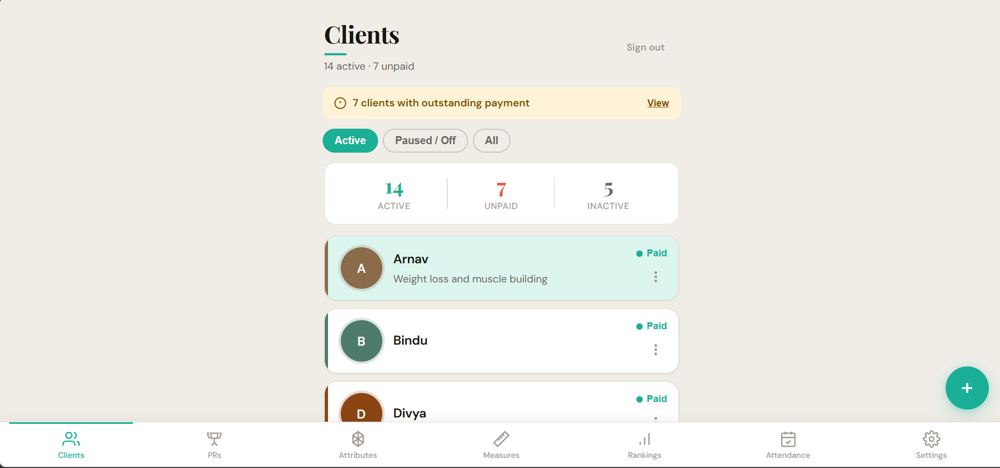
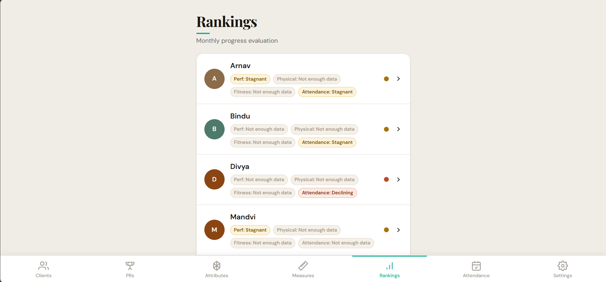
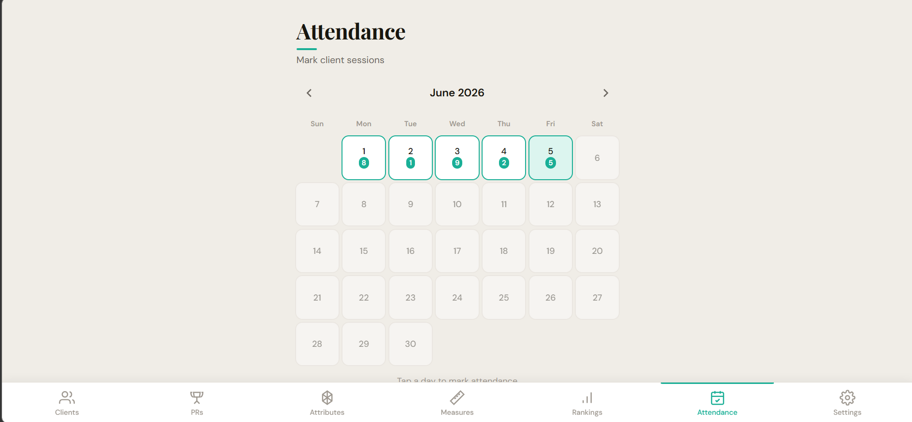

# Coach by Sam


🔗 **Live:** https://coach-by-sam.web.app

---

## Project Overview

Coach by Sam is a mobile-first Progressive Web App built for a personal fitness coach to replace spreadsheet-based client tracking. It manages the full client lifecycle — from onboarding and session attendance through to performance evaluation and progress reporting — in a single installable app designed to be used on a phone between classes. The app is intentionally scoped to one coach: all data is locked to a single authenticated Google account, keeping the architecture simple and the experience focused. Rather than being a generic SaaS platform, it solves a very specific problem: giving an independent coach a professional, fast tool that works the way she actually works.

---

## Screenshots

**Client list**


**Rankings — client evaluation detail**


**Attendance calendar**


---

## Features

| Module | What it does |
|--------|-------------|
| **Clients** | Active / paused / deactivated lifecycle, smart reactivation with start-date reset, original join date preserved |
| **PR Log** | Personal records per exercise (weight, time, reps), custom exercise support, weekly/monthly cadence |
| **Attributes** | Fitness qualities (mobility, stamina, flexibility, etc.) scored 1–10 per session |
| **Measurements** | Body measurements over time with delta indicators between sessions |
| **Attendance** | Global calendar view, per-day class toggling across all clients, 28-day billing cycles anchored to each client's start date |
| **Rankings** | Automated evaluation across four dimensions with separate coach/client label modes and a shareable progress card |
| **Progress Report** | Radar chart, PR trend lines, weight trend — accessible from each client's manage modal |
| **Settings** | Seed 10 dummy clients for demo, flush dummy data, flush all data |

---

## Architecture & Design Decisions

### Evaluation engine — pure functions, decoupled from Firebase

The evaluation engine lives entirely in `src/lib/evaluate.js` and has zero Firebase imports. It takes plain data arrays as input and returns status objects — making it independently testable without mocking any database calls.

Clients are evaluated across four dimensions:

| Dimension | Data source | Cadence | Logic |
|-----------|-------------|---------|-------|
| **Performance** | PR log | Weekly | New PR in window → improving; no PR for N days → declining |
| **Physical** | Measurements | Monthly | % change vs previous 30-day window; direction depends on goal type |
| **Fitness** | Attributes | Monthly | Score point change vs previous 30-day window |
| **Attendance** | Attendance records | Monthly | Attended / expected based on membership type (3×, 4×, or 5× per week) |

Status values: `improving` · `stagnant` · `declining` · `needs_attention` · `insufficient`

Each client has per-client thresholds (measurement % change, attribute point delta, PR stale days) configurable from their manage modal — so the coach can set stricter or looser bars per individual.

Goal-type awareness is built in: for a `recomposition` goal, Physical improvement requires waist measurement decreasing *and* arm or thigh measurement increasing. Only one direction counts as stagnant; neither counts as declining.

The coach and client see different labels for the same status — e.g. `declining` shows as "Declining" to Sam but "Let's refocus here" to the client — keeping the language appropriate for each audience without duplicating any logic.

---

### Client lifecycle — state machine with intentional reactivation

Clients move through three states:

```
active ──► paused ──► active
  │                     ▲
  └──► deactivated ─────┘
```

- **Pausing** preserves all data and keeps the client in the ClientPicker; intended for planned breaks
- **Deactivating** also preserves all data but signals a longer-term or administrative hold
- **Reactivating** from either state triggers a confirmation screen explaining that the start date will be reset to today

The reactivation flow was designed deliberately: rather than silently resetting the date or forcing the coach to remember to update it manually, the app surfaces a confirmation modal with the exact new date before committing. The original join date is saved as `originalStartDate` and shown in the edit profile view — written once, never overwritten on subsequent pauses.

---

### Attendance cycles — anchored to client start date, not calendar month

Attendance expected counts and billing cycles are calculated on **28-day rolling windows anchored to each client's individual start date**, not calendar months.

The problem with calendar months: a client who joins on the 20th and attends every class will show up as dramatically under-attended for most of that first month because the expected count is calculated against the full month. This makes the coach's dashboard misleading and the client's progress report discouraging.

With start-date anchoring, month 1 starts on day 1 for every client regardless of when in the calendar year they joined. Expected classes per cycle = `membershipType × 4`. The `getMonthWindow()` utility in `src/lib/utils.js` handles the arithmetic — given a client's start date and any target date, it returns the exact start and end of the 28-day cycle containing that date.

---

### Attendance model — per-day toggling, real-time, no save button

The attendance calendar shows all active and paused clients for any given day. Tapping a client row toggles their attendance — writing or deleting a Firestore document immediately with no intermediate save step. Each document's ID is the date string itself (`DD-MM-YYYY`), making lookups trivial and avoiding duplicates structurally rather than through validation logic.

---

## Tech stack

| Layer | Choice |
|-------|--------|
| Frontend | React 18 + Vite — no TypeScript, no UI framework |
| Styling | Plain CSS with custom design tokens — no Tailwind |
| Charts | Recharts (radar, line charts) |
| Auth | Firebase Authentication — Google Sign-In |
| Database | Firebase Firestore — subcollection structure per client |
| Hosting | Firebase Hosting (free tier) |
| Dates | date-fns |

---

## Getting started

### 1. Clone and install

```bash
git clone https://github.com/sgchandy404/coach-by-sam.git
cd coach-by-sam
npm install
```

### 2. Create a Firebase project

1. Go to [console.firebase.google.com](https://console.firebase.google.com) → **Add project**
2. Enable **Authentication** → Sign-in method → **Google**
3. Enable **Firestore Database** (start in production mode)
4. Register a **Web app** → copy the config values

### 3. Configure environment variables

```bash
cp .env.example .env.local
```

Fill in your Firebase values in `.env.local`:

```env
VITE_FIREBASE_API_KEY=...
VITE_FIREBASE_AUTH_DOMAIN=...
VITE_FIREBASE_PROJECT_ID=...
VITE_FIREBASE_STORAGE_BUCKET=...
VITE_FIREBASE_MESSAGING_SENDER_ID=...
VITE_FIREBASE_APP_ID=...
VITE_FIREBASE_MEASUREMENT_ID=...
```

### 4. Lock Firestore to your account

In Firebase Console → Firestore → **Rules**:

```
rules_version = '2';
service cloud.firestore {
  match /databases/{database}/documents {
    match /{document=**} {
      allow read, write: if request.auth != null
        && request.auth.uid == "YOUR_GOOGLE_UID_HERE";
    }
  }
}
```

Find your UID: sign in once → Firebase Console → Authentication → Users.

### 5. Run locally

```bash
npm run dev
# http://localhost:5173
```

### 6. Deploy

```bash
npm install -g firebase-tools
firebase login
firebase init hosting   # dist/, single-page app: yes
npm run build
firebase deploy
```

---

## Project structure

```
src/
├── components/
│   ├── BottomNav.jsx        # Fixed tab bar
│   ├── ClientPicker.jsx     # Shared client selector
│   ├── PageLoader.jsx       # Full-screen branded loader
│   └── ProgressReport.jsx   # Reusable report (radar, trends, stats)
├── data/
│   ├── exercises.js         # Built-in exercise library, attributes, measurements
│   └── seed.js              # 10 dummy clients with realistic data
├── lib/
│   ├── evaluate.js          # Pure evaluation engine — no Firebase dependency
│   ├── firebase.js          # Firebase init — reads from env vars
│   ├── firestore.js         # All Firestore read/write helpers
│   └── utils.js             # Date helpers, avatar colours, getMonthWindow
├── pages/
│   ├── AttendancePage.jsx
│   ├── AttributesPage.jsx
│   ├── ClientsPage.jsx      # Client list + full manage modal
│   ├── MeasurementsPage.jsx
│   ├── PRLogPage.jsx
│   ├── RankingsPage.jsx     # Evaluation overview + client detail + share card
│   └── SettingsPage.jsx
├── App.jsx                  # Auth gate, tab state, iOS sign-in handling
├── index.css                # Global styles and CSS design tokens
└── main.jsx
```

---

## Known limitations & deliberate scope

- **Single-coach only** — Firestore rules are locked to one Google UID by design. Multi-tenancy would require a full auth model redesign.
- **No payment processing** — payment status (paid/unpaid) is tracked as a manual flag only. No Stripe, no invoicing.
- **No offline support** — the app requires a network connection. Firestore's offline cache provides some resilience but it's not a deliberate offline-first design.
- **Evaluation windows are always relative to today** — there are no historical snapshots; re-evaluating past periods would require a different data model.
- **Mobile-first, not desktop-optimised** — the layout is capped at 480px and designed for one-handed phone use.

---

## Add to home screen

Open the deployed URL in Chrome on Android or Safari on iOS → tap the menu → **Add to Home Screen**. Runs as a standalone app with no browser chrome.

---

## Branch structure

```
dev      ← integration branch; all feature branches cut from here
staging  ← pre-production
prod     ← production
```

Feature branches: `feat/<name>`, cut from `dev`, merged back via `--no-ff`.
